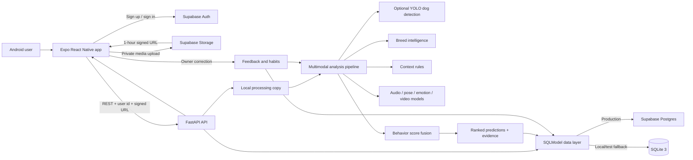
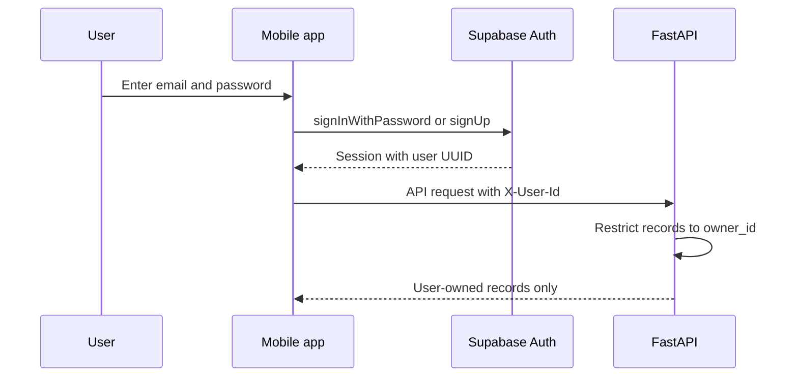
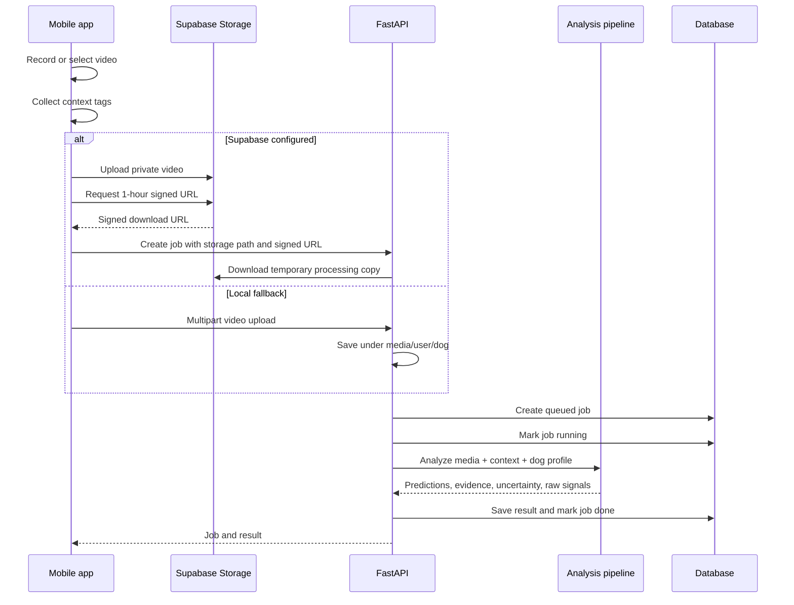
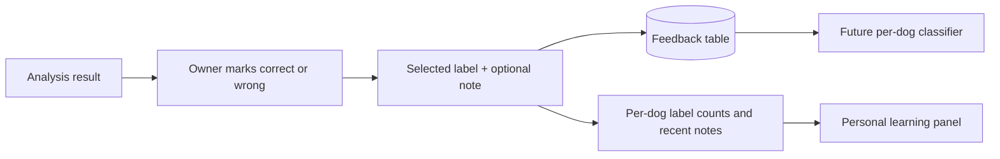

# Tommy Doggie Talkie

Tommy Doggie Talkie is an Android-first dog behavior interpretation app built with Expo React Native and FastAPI. A user creates a dog profile, optionally identifies its breed, uploads or records a video, and receives confidence-ranked behavior interpretations supported by detection, context, breed priors, and the dog's feedback history.

The product reports probable behavior such as `playful`, `hungry`, `attention seeking`, `anxious`, `alert/guarding`, `resting`, `pain/discomfort possible`, or `unknown`. It is not a literal dog-language translator and must not be used as a veterinary diagnosis.

## Current Status

Implemented:

- Expo React Native Android application.
- Supabase email/password authentication in the mobile app.
- Dog profile creation and selection.
- Manual and model-assisted breed identification.
- Breed behavior profiles and breed-aware interpretation adjustments.
- Video recording and media-library upload.
- Private Supabase Storage upload using short-lived signed URLs.
- Direct FastAPI upload when Supabase is not configured.
- FastAPI analysis-job, result, feedback, habit, dog, and breed APIs.
- Supabase Postgres as the configured production database.
- SQLite as the backend development/test fallback.
- Optional Ultralytics YOLO dog detection.
- Rule-based behavior fusion using detection, media, context, and breed signals.
- Owner feedback history and per-dog label counts.
- Supabase schema, storage bucket policy, and row-level security migrations.

Partially implemented or planned:

- Bark, animal-sound, dog-emotion, pose, tracking, and video-action models are registered as model subtasks but are not active production inference stages yet.
- Audio currently produces a placeholder signal from media metadata; it is not real bark classification.
- Personal learning currently stores feedback counts and notes. A trained per-dog classifier is planned after 30-50 corrected clips.
- Jobs run inside the FastAPI request when `RUN_JOBS_INLINE=true`. Redis/Celery or RQ workers are planned for production.
- The mobile app includes `expo-sqlite`, but offline mobile synchronization is not implemented. SQLite currently refers to the backend database fallback.
- The backend currently trusts `X-User-Id`; Supabase JWT signature verification must be added before production release.

## System Architecture



## Component Responsibilities

| Component | Responsibility |
|---|---|
| Expo React Native | Authentication UI, dog profiles, breed detection UI, video capture/upload, results, feedback, and habit display |
| Supabase Auth | Mobile user registration, login, session persistence, and user identity |
| Supabase Storage | Private storage for dog videos under `user_id/dog_id/file_name` |
| FastAPI | API validation, ownership checks, upload handling, analysis orchestration, result access, and feedback handling |
| SQLModel | Shared persistence layer for Supabase Postgres or SQLite |
| ML pipeline | Dog detection, context extraction, breed adjustments, score fusion, evidence, and uncertainty |
| Breed intelligence | Breed normalization, top predictions, behavior priors, interpretation notes, and health-watch cautions |
| Supabase Postgres | Production dog profiles, jobs, results, feedback, and habit summaries |
| SQLite | Local backend and automated-test database fallback |

## Runtime Flows

### 1. Authentication and Ownership



Development mode uses `local-demo-user` when no user header is supplied. This is convenient for local testing but is not production authentication. Production must send the Supabase access token to FastAPI and verify it before accepting the user UUID.

### 2. Dog and Breed Profile

1. The user creates a dog with name, optional breed, routines, and known habits.
2. A manually entered breed is stored with `breed_source=user_selected`.
3. The user can upload a clear dog photo through the Breed Intelligence panel.
4. FastAPI stores a temporary local copy and calls the optional Hugging Face breed classifier.
5. If the classifier is unavailable, a low-confidence fallback is returned instead of failing the app.
6. The top three predictions, confidence, source, and breed behavior profile are saved on the dog.
7. Future analyses use the saved breed behavior biases as supporting context, not as proof of intent.

Breed detection endpoint:

```text
POST /api/v1/dogs/{dog_id}/breed-detect
```

Breed profile lookup:

```text
GET /api/v1/breeds
GET /api/v1/breeds/{breed_slug}/behavior-profile
```

### 3. Video Upload and Analysis



Current default is inline processing:

```env
RUN_JOBS_INLINE=true
```

When a production worker queue is added, `POST /analysis-jobs` should return after creating a queued job, and the mobile app should poll `GET /analysis-jobs/{job_id}` until the state becomes `done` or `failed`.

### 4. Behavior Score Fusion

The current analysis flow is:

```text
uploaded video
  -> optional YOLO dog detection
  -> placeholder audio activity signal
  -> user context-tag boosts
  -> saved breed behavior biases
  -> health-watch context checks
  -> behavior score ranking
  -> top three predictions
  -> evidence + uncertainty + raw signals
```

Example response:

```json
{
  "job_id": "job-uuid",
  "dog_id": "dog-uuid",
  "top_predictions": [
    {
      "label": "playful",
      "confidence": 0.78,
      "evidence": [
        "dog detected in 12 sampled frame(s)",
        "context tags: play, toy",
        "breed profile: Labrador Retriever"
      ]
    }
  ],
  "uncertainty_reason": "audio model not loaded; using media-size placeholder signal",
  "needs_feedback": true,
  "evidence_timeline": [],
  "raw_signals": {}
}
```

Scores are interpretation aids. Breed priors are small adjustments and must never override strong visual, audio, contextual, or owner-feedback evidence.

### 5. Feedback and Personal Learning



Today, feedback updates:

- The selected behavior label count.
- The dog's ten most recent owner notes.
- The habit summary displayed in the app.

After a dog has at least 30-50 reliable corrected clips, the intended next step is a lightweight personalized classifier trained on frozen multimodal embeddings. The global model remains the fallback when personal evidence is sparse.

## Data Model

| Table | Purpose | Important fields |
|---|---|---|
| `dogs` | User-owned dog identity and personalization context | `owner_id`, `breed`, `breed_source`, `breed_confidence`, `breed_predictions`, `breed_behavior_profile`, `routines`, `known_habits` |
| `analysis_jobs` | Upload processing lifecycle | `dog_id`, `status`, `progress`, `storage_path`, `context_tags`, `error_message` |
| `analysis_results` | Persisted behavior interpretation | `top_predictions`, `uncertainty_reason`, `evidence_timeline`, `raw_signals` |
| `feedback` | Owner corrections for a result | `selected_label`, `is_correct`, `note` |
| `habit_summaries` | Aggregated personal-dog history | `label_counts`, `recent_notes`, `updated_at` |

Supabase row-level security restricts each table to `auth.uid() = owner_id`. The private `dog-videos` bucket restricts access to objects whose first path segment is the authenticated user's UUID.

## ML Subtasks

| Subtask | Model or approach | Current state |
|---|---|---|
| Dog detection | Ultralytics YOLO `yolo11n.pt` | Optional adapter implemented |
| Dog tracking | YOLO plus ByteTrack/DeepSORT | Planned |
| Breed detection | `djhua0103/dog-breed-resnet50` | Optional adapter with fallback |
| Breed intelligence | Curated breed profiles and score biases | Implemented |
| Pose/keypoints | DeepLabCut SuperAnimal Quadruped | Planned; license review required |
| Bark detection | `rmarcosg/bark-detection-model` | Planned |
| Animal sound | HuBERT animal-sound classifier | Planned |
| Dog emotion image | `Dewa/dog_emotion_v2` | Planned; weak signal only |
| Video behavior | Rules now, VideoMAE or SlowFast later | Rule baseline implemented |
| Personal learning | Counts/notes now, lightweight classifier later | Baseline implemented |

Install optional ML dependencies with:

```powershell
cd backend
python -m pip install ".[ml]"
```

Model selection must be based on held-out phone videos from the intended breeds and environments, not model popularity. Track detection precision/recall, bark F1, breed top-1/top-3 accuracy, behavior agreement with owner corrections, inference time, and failure rates.

## API Reference

| Method | Endpoint | Purpose |
|---|---|---|
| `GET` | `/health` | Runtime, Supabase, and SQLite status |
| `POST` | `/api/v1/dogs` | Create a dog |
| `GET` | `/api/v1/dogs` | List the current user's dogs |
| `PATCH` | `/api/v1/dogs/{dog_id}` | Update a dog profile |
| `POST` | `/api/v1/dogs/{dog_id}/breed-detect` | Detect and save breed predictions |
| `GET` | `/api/v1/dogs/{dog_id}/habits` | Read personal habit summary |
| `POST` | `/api/v1/dogs/{dog_id}/personal-model/retrain` | Request personal retraining readiness |
| `GET` | `/api/v1/breeds` | List breed behavior profiles |
| `GET` | `/api/v1/breeds/{breed_slug}/behavior-profile` | Read one breed profile |
| `POST` | `/api/v1/analysis-jobs` | Upload media or submit a signed Storage URL |
| `GET` | `/api/v1/analysis-jobs/{job_id}` | Read job state and progress |
| `GET` | `/api/v1/analysis-jobs/{job_id}/result` | Read completed interpretation |
| `POST` | `/api/v1/analysis-jobs/{job_id}/feedback` | Save owner correction |

Interactive API documentation is available at:

```text
http://localhost:8000/docs
```

## Repository Layout

```text
tommy-doggie-talkie/
|-- backend/
|   |-- app/
|   |   |-- api/                 FastAPI dependencies and routes
|   |   |-- core/                Configuration and database engine
|   |   |-- services/            Storage, jobs, breed, and ML pipeline
|   |   |-- main.py              FastAPI application
|   |   |-- models.py            SQLModel persistence models
|   |   `-- schemas.py           Request/response schemas
|   |-- tests/                   Backend integration tests
|   |-- .env.example
|   `-- pyproject.toml
|-- mobile/
|   |-- src/
|   |   |-- api/                 FastAPI and Supabase clients
|   |   |-- components/          Shared UI components
|   |   |-- screens/             Auth, dog, breed, upload, result, habits
|   |   `-- types.ts
|   |-- App.tsx
|   |-- app.json
|   |-- eas.json
|   |-- .env.example
|   `-- package.json
|-- supabase/
|   |-- migrations/              Production schema migrations
|   |-- config.toml              Local Supabase configuration
|   `-- schema.sql               Re-runnable complete schema
|-- docs/
|   `-- model-subtasks.md
`-- README.md
```

## Configuration

### Backend environment

Create `backend/.env` from `backend/.env.example`.

| Variable | Purpose | Local default |
|---|---|---|
| `APP_ENV` | Environment label exposed by health check | `development` |
| `API_HOST` | Uvicorn bind host | `0.0.0.0` |
| `API_PORT` | Uvicorn port | `8000` |
| `DATABASE_URL` | Supabase Postgres or SQLite connection | `sqlite:///./dog_translator.db` |
| `LOCAL_MEDIA_DIR` | Temporary/direct upload location | `./media` |
| `RUN_JOBS_INLINE` | Process job inside API request | `true` |
| `SUPABASE_URL` | Supabase project URL | empty |
| `SUPABASE_SERVICE_ROLE_KEY` | Optional server-side private Storage access | empty |
| `SUPABASE_STORAGE_BUCKET` | Private media bucket | `dog-videos` |
| `CORS_ORIGINS` | Comma-separated allowed frontend origins | local Expo origins |

Never commit `backend/.env` or a Supabase service-role key.

### Mobile environment

Create `mobile/.env` from `mobile/.env.example`.

| Variable | Purpose |
|---|---|
| `EXPO_PUBLIC_API_BASE_URL` | FastAPI URL reachable from Android |
| `EXPO_PUBLIC_SUPABASE_URL` | Supabase project URL |
| `EXPO_PUBLIC_SUPABASE_PUBLISHABLE_KEY` | Supabase client publishable key |
| `EXPO_PUBLIC_SUPABASE_STORAGE_BUCKET` | Private video bucket name |

Use `http://10.0.2.2:8000` from the Android emulator. On a physical phone, use the development computer's LAN address, for example `http://192.168.1.20:8000`.

## Local Development

### Backend

```powershell
cd backend
python -m venv .venv
.\.venv\Scripts\Activate.ps1
python -m pip install --upgrade pip
python -m pip install ".[dev]"
Copy-Item .env.example .env
uvicorn app.main:app --reload --host 0.0.0.0 --port 8000
```

Use SQLite for a fully local backend:

```env
DATABASE_URL=sqlite:///./dog_translator.db
RUN_JOBS_INLINE=true
```

### Mobile

```powershell
cd mobile
npm install
Copy-Item .env.example .env
npm start
```

Then open the project in Expo Go or an Android emulator.

## Supabase Setup

1. Create or select a Supabase project.
2. Authenticate the CLI with a personal access token:

   ```powershell
   npx supabase login --token YOUR_ACCESS_TOKEN
   ```

3. Link the project:

   ```powershell
   npx supabase link --project-ref YOUR_PROJECT_REF
   ```

4. Apply migrations:

   ```powershell
   npx supabase db push
   ```

5. Configure the backend and mobile environment files.
6. Confirm the `dog-videos` bucket is private and the storage policy is active.
7. Keep database passwords, access tokens, and service-role keys outside git.

The repository currently targets Supabase project reference `qvokxgvqhegbpgrbcznq`. The CLI still requires a Supabase personal access token; an account password cannot authenticate `supabase login`.

## Android Builds

Remain on React Native for the current product. FastAPI performs the heavy inference, while Expo provides the Android UI, camera/library access, authentication, and APK packaging. Kotlin can be added later as a native module if on-device TensorFlow Lite, MediaPipe, background video processing, or camera performance becomes necessary.

Development:

```powershell
cd mobile
npm start
```

Local native Android project:

```powershell
npm run android
```

Installable preview APK:

```powershell
npx eas-cli build -p android --profile preview
```

Play Store AAB:

```powershell
npx eas-cli build -p android --profile production
```

The preview profile creates an APK. The production profile creates an Android App Bundle.

## Validation

Backend:

```powershell
cd backend
pytest -q
ruff check .
```

Mobile:

```powershell
cd mobile
npm run typecheck
npx expo install --check
```

Current automated coverage verifies:

- Health endpoint.
- Dog creation.
- Video upload and inline analysis.
- Result retrieval.
- Feedback and habit aggregation.
- Breed profile listing and lookup.
- Breed detection fallback.

## Security and Product Boundaries

- Replace `X-User-Id` trust with verified Supabase JWT authentication before production.
- Keep the Supabase service-role key server-side only.
- Keep videos private and preserve the storage row-level security policy.
- Add upload size, duration, MIME, malware, and rate-limit validation before public launch.
- Add retention and account-deletion workflows for videos and derived media.
- Do not describe the output as veterinary advice or guaranteed emotional state.
- Review every model and dataset license before commercial distribution.
- DeepLabCut SuperAnimal weights require particular license review.
- Treat low-confidence breed and behavior outputs as `unknown` and ask for owner feedback.

## Next Production Milestones

1. Verify Supabase JWTs in FastAPI.
2. Move analysis jobs to Redis plus Celery/RQ workers.
3. Replace placeholder audio activity with validated bark, whine, growl, howl, and pant classification.
4. Add frame extraction, dog tracking, and pose keypoints.
5. Benchmark each model on held-out Android phone recordings.
6. Train a personal classifier only after enough owner-confirmed clips exist.
7. Add mobile offline queueing and synchronization if offline use is required.
8. Add monitoring, deletion, retention, and model-version audit trails.
